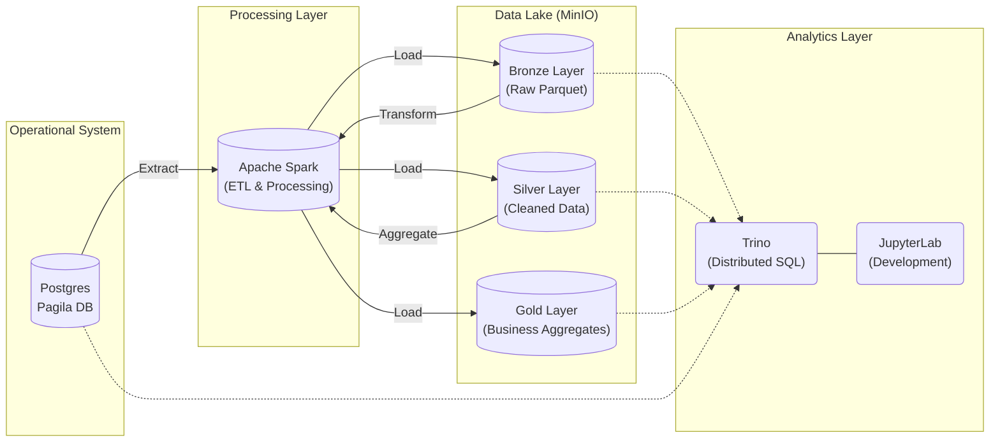

# Lesson 7: Building a Data Lakehouse

Welcome to the capstone project of the Data Engineering course! In this lesson, we will move beyond simple ETL and build a modern **Data Lakehouse** architecture. You will integrate operational databases, distributing computing, and object storage to create a scalable data platform.

## 🎯 Learning Objectives

By the end of this lesson, you will be able to:

1.  **Build a Medallion Architecture**: Implement the Bronze (Raw), Silver (Cleaned), and Gold (Aggregated) layers pattern.
2.  **Decouple Storage and Compute**: Understand why modern architectures separate where data lives (MinIO) from where it is processed (Spark).
3.  **Implement Batch ETL**: Use Apache Spark to extract data from a transactional DB (Postgres) and load it into a Data Lake.
4.  **Perform Federated Analytics**: Use Trino to query data across different systems (Postgres and MinIO) using standard SQL.

---

## 🏗️ Architecture Overview

Unlike previous lessons where we might have loaded data directly into a Data Warehouse, here we use a **Lakehouse** approach.



### 🧰 Technology Stack & Rationale

| Component | Technology | Why did we choose this? |
|-----------|------------|-------------------------|
| **Source System** | **PostgreSQL** | Represents a typical OLTP (Online Transaction Processing) database found in production. It holds the "live" business data. |
| **Object Storage** | **MinIO** | **Why not HDFS?** Modern data engineering heavily favors **Object Storage** (like AWS S3) over HDFS because it decouples storage from compute. MinIO mimics the S3 API locally, allowing you to write cloud-native code that works on AWS/Azure/GCP. |
| **Compute Engine** | **Apache Spark** | Spark is the de facto standard for big data processing. It handles massive datasets in-memory and is fault-tolerant. We use it here to perform the heavy lifting of moving and transforming data. |
| **Query Engine** | **Trino** | **Why not just Spark SQL?** Trino (formerly PrestoSQL) is designed for *interactive*, high-speed queries. It can query data *where it lives* (Federation) without moving it. It allows us to join data from Postgres (live) with MinIO (historical) in a single SQL query. |

---

## 📁 Project Structure

```bash
lesson7/
├── docker-compose.yml          # Defines our 5 services (Postgres, Spark, MinIO, Trino, Jupyter)
├── notebooks/
│   └── 1_intro_architecture.ipynb  # <--- START HERE: The main lab notebook
├── scripts/
│   └── download-jars.sh        # Downloads S3 and Postgres drivers for Spark
├── configs/                    # Configuration files
│   ├── spark/                  # Spark defaults
│   └── trino/                  # Trino catalog definitions (how Trino finds MinIO/Postgres)
├── init-scripts/               # SQL scripts to populate the specific Pagila database
└── spark-jobs/                 # (Optional) Place for standalone Python scripts
```

---

## 🚀 Setup & Installation

### Step 1: Download Dependencies
Spark needs specific "drivers" (JAR files) to talk to Postgres and S3 (MinIO). We download these manually to inject them into the container.

```bash
cd lesson7
./scripts/download-jars.sh
```
*Why? Docker images often come "clean". In production, you'd bake these into a custom Docker image, but for labs, volume mounting downloaded JARs is faster.*

### Step 2: Start the Environment
We use Docker Compose to spin up the entire cluster.

```bash
docker compose up -d
```
*Wait about 30-60 seconds for all services to initialize.*

### Step 3: Verify Services
Ensure every container is in state `Up`.

```bash
docker compose ps
```
*Look for: `postgres`, `spark-master`, `minio`, `trino`, and `jupyter`.*

---

## 🧪 Lab Exercises

### Exercise 1: The End-to-End Pipeline (Required)
Your primary task is to execute the provided Jupyter Notebook. This notebook effectively "builds" the pipeline.

1.  Open JupyterLab: [http://localhost:8888](http://localhost:8888)
    *   **Password/Token**: `bigdata`
2.  Open `notebooks/1_intro_architecture.ipynb`.
3.  **Read carefully** and execute cells one by one.
    *   **Extract**: You will pull data from Postgres.
    *   **Load**: Save it as Parquet in MinIO (Bronze).
    *   **Transform**: Filter active customers and save to Silver.

### Exercise 2: Create the "Gold" Layer (Challenge)
The notebook stops at the Silver layer. Your challenge is to create a Gold layer aggregation.

**Task**: Calculate the count of customers per store.

1.  Create a new cell in the notebook.
2.  Read the **Silver** data.
3.  Group by `store_id` and count.
4.  Write this result to `s3a://gold/customer_counts` in MinIO.

*Hint:*
```python
df_gold = spark.read.parquet("s3a://silver/customer_active")
df_gold.groupBy("store_id").count().write.parquet("s3a://gold/customer_counts")
```

### Exercise 3: Federated Querying with Trino (Advanced)
Now that data is in the Lake, let's query it using SQL without Spark.

1.  Enter the Trino container:
    ```bash
    docker exec -it trino trino
    ```
2.  **Query the Data Lake (MinIO)**:
    ```sql
    SHOW SCHEMAS FROM minio;
    -- You should see 'bronze', 'silver', 'gold' (if you created it)
    SELECT * FROM minio.silver.customer_active LIMIT 5;
    ```
3.  **Federated Join (The "Magic")**:
    Join the *historical/processed* data in MinIO with *live* data in Postgres.
    ```sql
    SELECT 
        l.customer_id, 
        l.first_name, 
        p.email 
    FROM minio.silver.customer_active l
    JOIN postgres.public.customer p ON l.customer_id = p.customer_id
    LIMIT 5;
    ```

---

## 🧹 Cleanup

When finished, remove the containers and the data volumes to save space.

```bash
docker compose down -v
```
**Warning**: This deletes all data in the MinIO buckets and the Postgres database changes.
